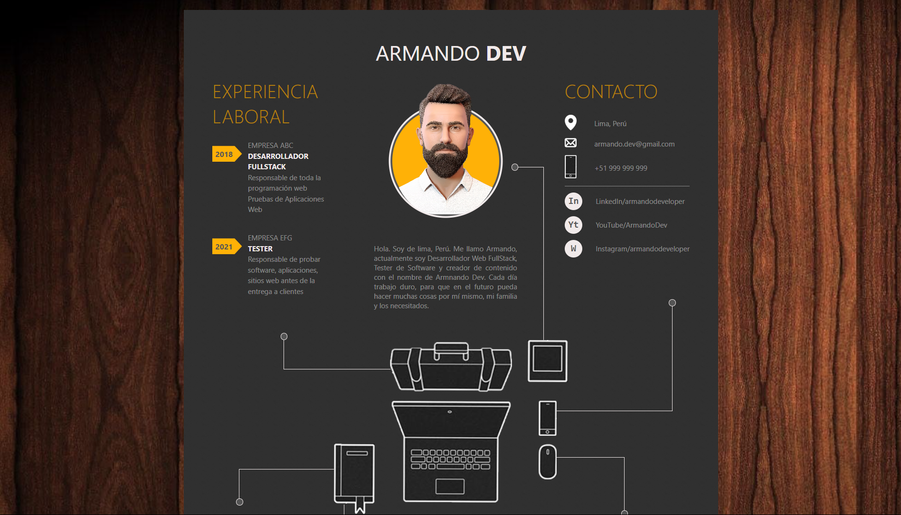

# 💼 Curriculum Vitae HTML/CSS

<p align="center">
  
</p>

<p align="center">
  
  
  
</p>

## 📋 Tabla de Contenidos
- [Descripción](#-descripción)
- [Características](#-características)
- [Demo en Vivo](#-demo-en-vivo)
- [Instalación](#-instalación)
- [Personalización](#-personalización)
- [Estructura de Archivos](#-estructura-de-archivos)
- [Contribución](#-contribución)
- [Licencia](#-licencia)
- [Contacto](#-contacto)

## 📝 Descripción
Una plantilla de CV moderna, responsiva y profesional construida utilizando HTML y CSS puro. Perfecta para desarrolladores que buscan presentar su experiencia de manera elegante y efectiva.

## ✨ Características
- 🎨 Diseño moderno y minimalista
- 📱 Completamente responsivo
- 🚀 Optimizado para rendimiento
- 🔧 Fácil de personalizar
- 📊 Barras de progreso para habilidades
- 🖼️ Sección de portfolio
- 📱 Información de contacto interactiva

## 🌐 Demo en Vivo
[Ver Demo](https://gianmattus-programmer.github.io/cv-html-css/)

## 🛠️ Instalación
1. Clona el repositorio:
```bash
git clone https://github.com/gianmattus-programmer/cv-html-css.git
```

2. Abre el archivo `index.html` en tu navegador

## 🎨 Personalización
### Modificar Información Personal
```html
<div class="name">TU_NOMBRE <span>DEV</span></div>
```

### Actualizar Habilidades
```html
<div class="skill">
    <li>
        <div style="--point: 90"></div>
        <span>Tu Habilidad</span>
    </li>
</div>
```

### Cambiar Colores
```css
:root {
    --primary-color: #tu-color;
    --secondary-color: #tu-color;
}
```

## 📁 Estructura de Archivos
```
cv-html-css/
├── index.html          # Archivo principal
├── style.css          # Estilos CSS
├── images/           # Carpeta de imágenes
│   ├── avatar.png
│   └── icons/
├── LICENSE           # Licencia MIT
└── README.md        # Documentación
```

## 🤝 Contribución
Las contribuciones son bienvenidas:
1. Fork el proyecto
2. Crea tu rama (`git checkout -b feature/AmazingFeature`)
3. Commit tus cambios (`git commit -m 'Add: AmazingFeature'`)
4. Push a la rama (`git push origin feature/AmazingFeature`)
5. Abre un Pull Request

## 📄 Licencia
Distribuido bajo la Licencia MIT. Ver `LICENSE` para más información.

## 📬 Contacto
Gianmattus Programmer
- GitHub: [@gianmattus-programmer](https://github.com/gianmattus-programmer)
- LinkedIn: [Tu LinkedIn]
- Portfolio: [Tu Portfolio]

---
<p align="center">
  Hecho con ❤️ por <a href="https://github.com/gianmattus-programmer">Gianmattus Programmer</a>
</p>
